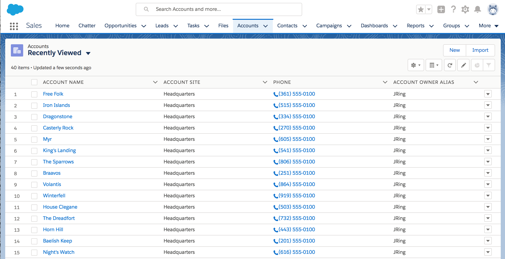
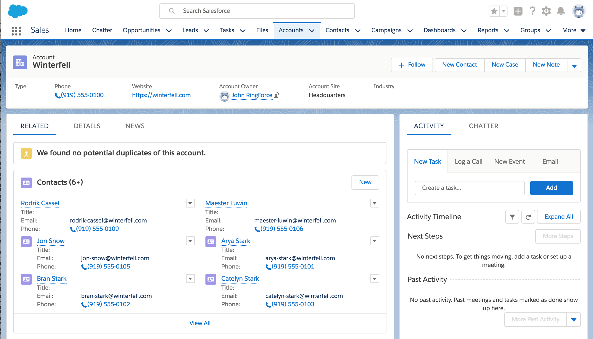
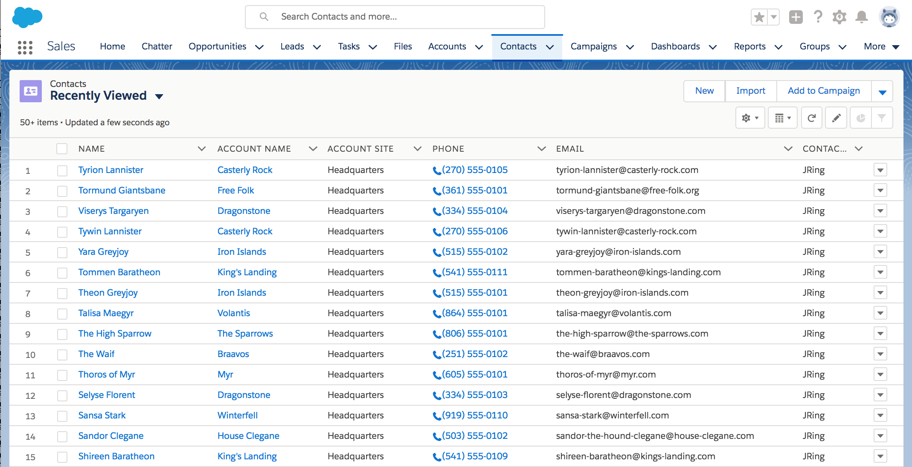
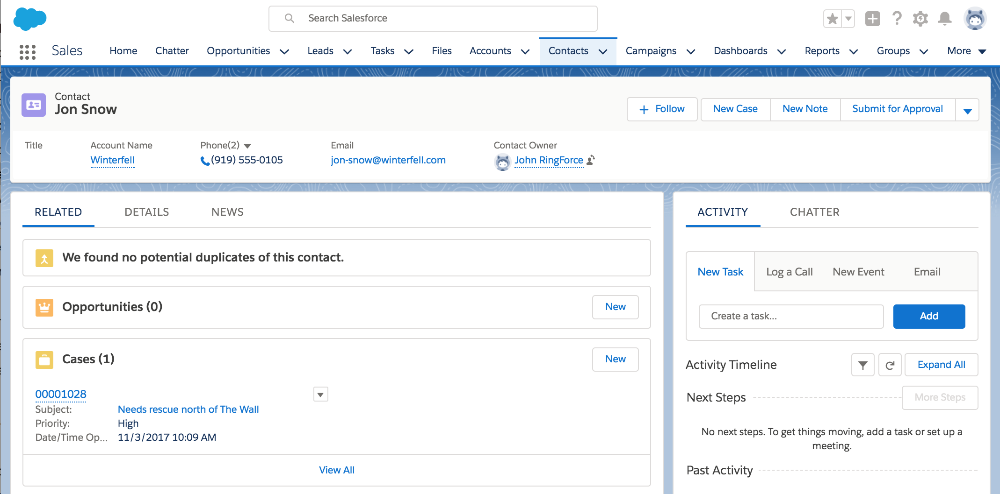
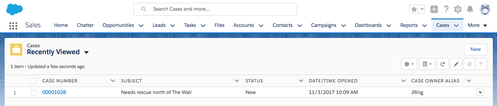
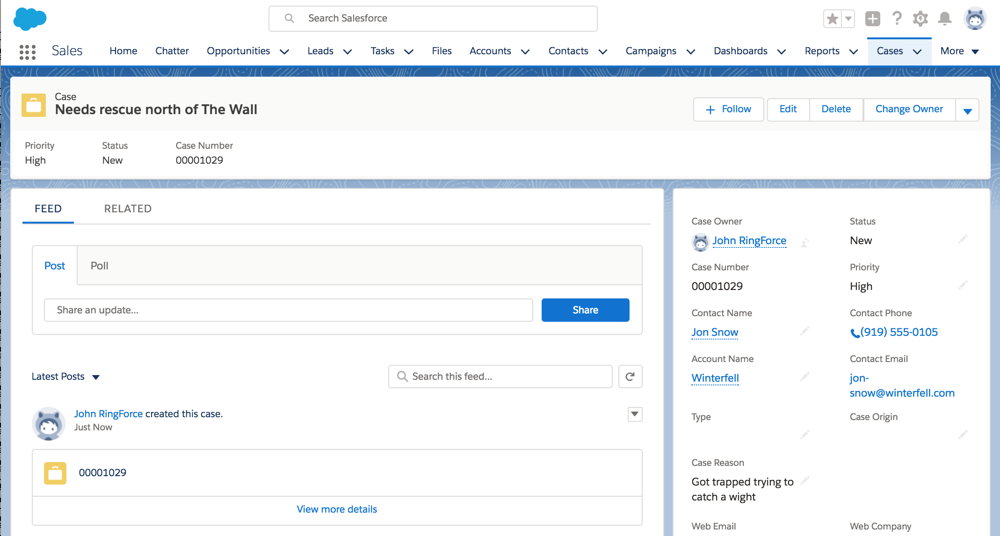

# Game of Thrones Data

[![Go CI][go-ci-svg]][go-ci-url]
[![Go Lint][go-lint-svg]][go-lint-url]
[![Go SAST][go-sast-svg]][go-sast-url]
[![Go Report Card][goreport-svg]][goreport-url]
[![Docs][docs-godoc-svg]][docs-godoc-url]
[![Visualization][viz-svg]][viz-url]
[![License][license-svg]][license-url]

 [go-ci-svg]: https://github.com/grokify/gameofthrones/actions/workflows/go-ci.yaml/badge.svg?branch=main
 [go-ci-url]: https://github.com/grokify/gameofthrones/actions/workflows/go-ci.yaml
 [go-lint-svg]: https://github.com/grokify/gameofthrones/actions/workflows/go-lint.yaml/badge.svg?branch=main
 [go-lint-url]: https://github.com/grokify/gameofthrones/actions/workflows/go-lint.yaml
 [go-sast-svg]: https://github.com/grokify/gameofthrones/actions/workflows/go-sast-codeql.yaml/badge.svg?branch=main
 [go-sast-url]: https://github.com/grokify/gameofthrones/actions/workflows/go-sast-codeql.yaml
 [goreport-svg]: https://goreportcard.com/badge/github.com/grokify/gameofthrones
 [goreport-url]: https://goreportcard.com/report/github.com/grokify/gameofthrones
 [docs-godoc-svg]: https://pkg.go.dev/badge/github.com/grokify/gameofthrones
 [docs-godoc-url]: https://pkg.go.dev/github.com/grokify/gameofthrones
 [viz-svg]: https://img.shields.io/badge/visualizaton-Go-blue.svg
 [viz-url]: https://mango-dune-07a8b7110.1.azurestaticapps.net/?repo=grokify%2Fgameofthrones
 [license-svg]: https://img.shields.io/badge/license-MIT-blue.svg
 [license-url]: https://github.com/grokify/gameofthrones/blob/master/LICENSE

A Go library providing Game of Thrones character and organization data from the TV series. Generate realistic demo data for software applications with fictitious phone numbers, email addresses, and organizational affiliations.

## Features

- 85 characters from the Game of Thrones TV series
- 31 organizations (houses, groups, and locations)
- Automatic family name to organization mapping
- Demo data generation with realistic US phone numbers and email addresses
- SCIM-compatible user format for identity system integration
- CRM integrations for Salesforce and Pipedrive

## Installation

```bash
go get github.com/grokify/gameofthrones
```

## Quick Start

```go
package main

import (
    "fmt"
    "github.com/grokify/gameofthrones"
)

func main() {
    // Get all characters
    chars := gameofthrones.Characters()
    fmt.Printf("Loaded %d characters\n", len(chars))

    // Print first character
    char := chars[0]
    fmt.Printf("Actor: %s\n", char.Actor.DisplayName)
    fmt.Printf("Character: %s\n", char.Character.DisplayName)
    fmt.Printf("Organization: %s\n", char.Organization.Name)
}
```

## Library Usage

### Getting Characters

Characters are loaded from embedded CSV data, so no external files are needed:

```go
// Get all 85 characters
chars := gameofthrones.Characters()

for _, char := range chars {
    fmt.Printf("%s played by %s (%s)\n",
        char.Character.DisplayName,
        char.Actor.DisplayName,
        char.Organization.Name)
}
```

### Creating Characters Manually

```go
char := gameofthrones.NewCharacterSimple(gameofthrones.NewCharacterSimpleOpts{
    ActorName:       "Sean Bean",
    GivenName:       "Eddard",
    FamilyName:      "Stark",
    NickName:        "Ned",
    AddOrganization: true, // Automatically maps Stark -> Winterfell
})

fmt.Println(char.Character.DisplayName) // Eddard "Ned" Stark
fmt.Println(char.Organization.Name)     // Winterfell
```

### Getting Organizations

```go
// List of all 31 organization names
for _, org := range gameofthrones.Organizations {
    fmt.Println(org)
}

// Map a family name to an organization
user := scim.User{Name: scim.Name{FamilyName: "Lannister"}}
org := gameofthrones.GetOrganizationForUser(user)
fmt.Println(org.Name) // Casterly Rock
```

### Demo Data with Phone Numbers and Emails

Generate complete demo data with realistic contact information:

```go
// Get characters with generated phone numbers and emails
demoChars, err := gameofthrones.GetDemoCharacters()
if err != nil {
    log.Fatal(err)
}

for _, char := range demoChars.CharactersSorted() {
    fmt.Printf("%s\n", char.Character.DisplayName)
    if len(char.Character.Emails) > 0 {
        fmt.Printf("  Email: %s\n", char.Character.Emails[0].Value)
    }
    if len(char.Character.PhoneNumbers) > 0 {
        fmt.Printf("  Phone: %s\n", char.Character.PhoneNumbers[0].Value)
    }
}
```

Example output:

```
Arya Stark
  Email: arya-stark@winterfell.com
  Phone: +12015551234
Cersei Lannister
  Email: cersei-lannister@casterly-rock.com
  Phone: +12125559876
```

### Demo Organizations

```go
demoOrgs, err := gameofthrones.GetDemoOrganizations()
if err != nil {
    log.Fatal(err)
}

for name, org := range demoOrgs.OrganizationsMap {
    fmt.Printf("%s: %s (%s)\n", name, org.E164(), org.Domain)
}
```

## CLI Tool

The `got` CLI provides commands for viewing data and integrating with CRM systems.

### Installation

```bash
go install github.com/grokify/gameofthrones/cmd/got@latest
```

### Show Characters and Organizations

```bash
# List all characters
got show characters

# Search for characters (by name, actor, or organization)
got show characters --query stark

# Output as JSON
got show characters --query lannister --format json

# List all organizations
got show organizations

# Search organizations
got show organizations --query watch
```

### RingCentral Export

Export character data in RingCentral contact format:

```bash
# Output to stdout
got ringcentral build

# Save to file
got ringcentral build --output contacts.json

# Compact JSON (not prettified)
got ringcentral build --pretty=false
```

## CRM Integrations

### Salesforce

Create demo Accounts, Contacts, and Cases in Salesforce using Game of Thrones data.

#### Setup

1. Create a Connected App in Salesforce under `Setup` > `Apps` > `App Manager` with OAuth Settings

2. Create a `.env` file with your credentials:

```
SALESFORCE_CLIENT_ID=myClientId
SALESFORCE_CLIENT_SECRET=myClientSecret
SALESFORCE_USERNAME=myUsername
SALESFORCE_PASSWORD=myPassword
SALESFORCE_SECURITY_TOKEN=mySecurityToken
SALESFORCE_INSTANCE_NAME=na1
```

- `SALESFORCE_CLIENT_ID` and `SALESFORCE_CLIENT_SECRET` are from your Connected App
- `SALESFORCE_USERNAME` and `SALESFORCE_PASSWORD` are your login credentials
- `SALESFORCE_SECURITY_TOKEN` is configured under `Settings` > `My Personal Information` > `Reset My Security Token`

#### Usage

```bash
# Create data in order
got salesforce create-accounts
got salesforce create-contacts
got salesforce create-cases

# Delete data
got salesforce delete-contacts
got salesforce delete-accounts
```

| Command | Description |
|---------|-------------|
| `got salesforce create-accounts` | Create Salesforce Accounts from GoT organizations |
| `got salesforce create-contacts` | Create Contacts linked to Accounts |
| `got salesforce create-cases` | Create sample Cases |
| `got salesforce delete-accounts` | Delete all created Accounts |
| `got salesforce delete-contacts` | Delete all created Contacts |

#### Screenshots

| Accounts | Account Detail |
|----------|----------------|
|  |  |

| Contacts | Contact Detail |
|----------|----------------|
|  |  |

| Cases | Case Detail |
|-------|-------------|
|  |  |

### Pipedrive

Create demo Organizations and Persons in Pipedrive.

#### Setup

1. Get your API key from Pipedrive under `Settings` > `Personal preferences` > `API`

2. Create a `.env` file:

```
PIPEDRIVE_API_KEY=myApiKey
PIPEDRIVE_BASE_URL=https://yourcompany.pipedrive.com/v1
```

#### Usage

```bash
# Create organizations (GoT houses)
got pipedrive create-orgs

# Create persons (GoT characters)
got pipedrive create-people

# List existing data
got pipedrive get-persons
got pipedrive get-org-fields

# Override base URL via flag
got pipedrive create-orgs --base-url https://yourcompany.pipedrive.com/v1
```

| Command | Description |
|---------|-------------|
| `got pipedrive create-orgs` | Create Pipedrive Organizations from GoT houses |
| `got pipedrive create-people` | Create Persons from GoT characters |
| `got pipedrive get-persons` | List all Persons |
| `got pipedrive get-org-fields` | List organization field definitions |

## Data Reference

### Organizations (31)

The library includes these Game of Thrones organizations:

| Major Houses | Other Locations | Groups |
|--------------|-----------------|--------|
| Winterfell | Braavos | Night's Watch |
| King's Landing | Dorne | Free Folk |
| Casterly Rock | Iron Islands | Dothraki |
| Dragonstone | The Vale | Second Sons |
| Highgarden | The Riverlands | The Sparrows |
| The Dreadfort | Tarth | Lord of Light |
| Bear Island | Volantis | Order of Maesters |

### Family Name Mappings

Characters are automatically mapped to organizations by family name:

| Family | Organization |
|--------|--------------|
| Stark | Winterfell |
| Lannister | Casterly Rock |
| Targaryen | Dragonstone |
| Baratheon | King's Landing |
| Tyrell | Highgarden |
| Martell | Dorne |
| Greyjoy | Iron Islands |
| Bolton | The Dreadfort |
| Snow | Winterfell |

See `FamilyNameToOrganization` in [organizations.go](organizations.go) for the complete mapping.

## License

MIT License - see [LICENSE](LICENSE) for details.
