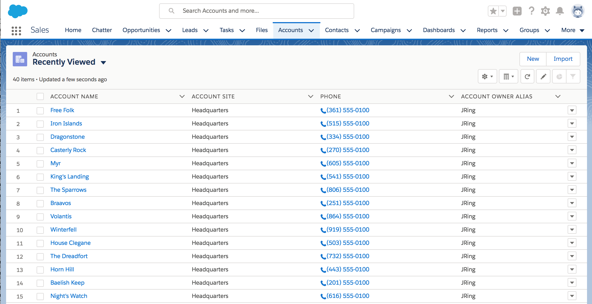
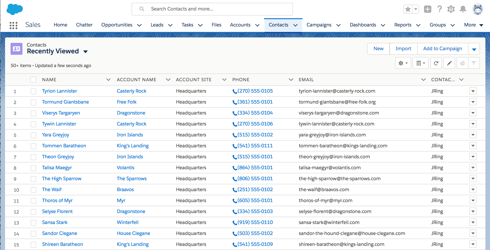
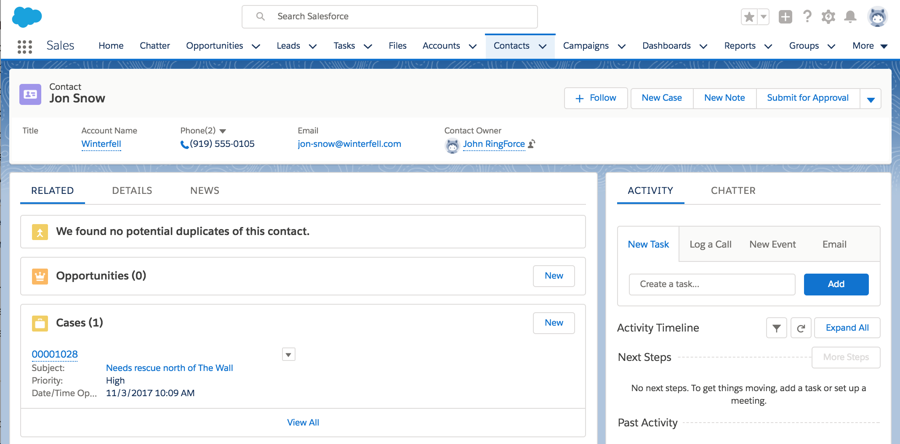
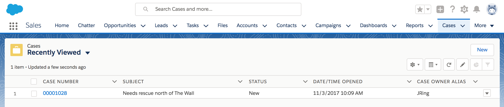
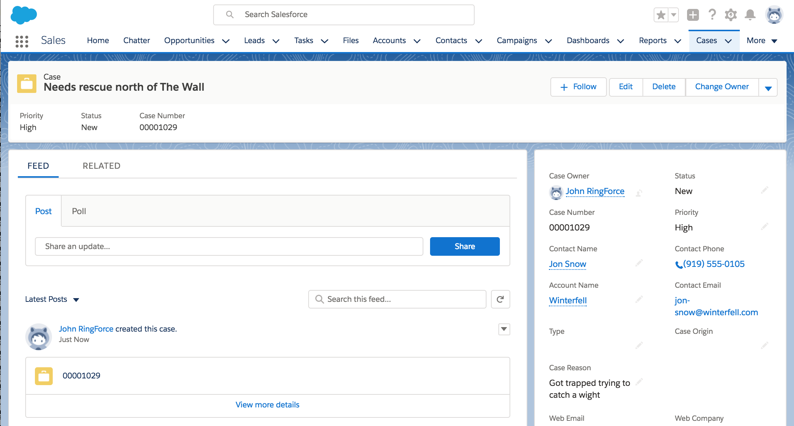

# Create Game of Thrones Data in Salesforce

This code creates Saleforce demo data using Game of Thrones data. It augments the data with ficticious phone numbers, email addresses and websites.

The data should be created in this order:

1. Accounts
2. Contacts
3. Cases

## Instructions

```bash
$ go get github.com/grokify/gameofthrones
$ cd $GOPATH/src/github/grokify/gameofthrones/examples/salesforce
$ go run create.go -action create_accounts
```

The following are valid actions:

* `create_accounts`
* `delete_accounts`
* `create_contacts`
* `delete_contacts`
* `create_cases`

## Screenshots

### Accounts



### Contacts





### Cases



